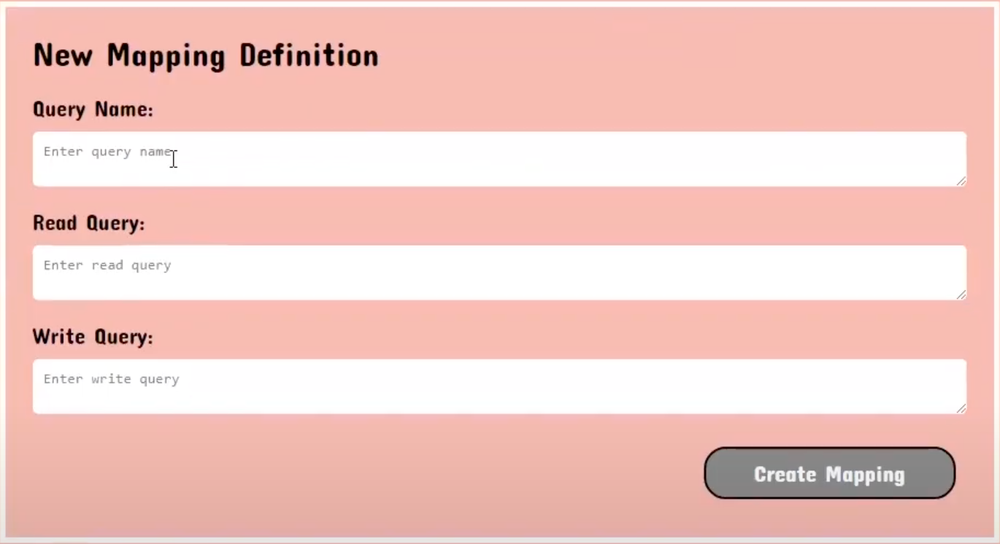

# Installation
[For Local Usage](README.md)

# General Use Instructions
## Signing Up for an Account
1. From the landing page, select the user type that corresponds to your role. 
2. Then, click the "Sign in with Google", and follow the instructions on the Google Authentication pop-up. 

3. Once your account has been created, you will be taken to the homepage view that corresponds with your account type. 

#### Admin Homepage

#### Regular User Homepage 

## Logging In to your Account
1. Click on the Login button in the middle of the landing page to log in with your Google account.

2. The Google login page will pop up. Select the Google account that you previously used to sign-up with, and enter your Google password to log in.

## Navigating Back to your Homepage
Click the House icon in the top-left corner of the page to navigate back to the homepage.

# Administrator Users
## Create a Mapping
- Click on the "Create Mapping" button from the homepage to navigate to the page to create new mappings. 

- The "SPARQL Mappings" panel on the left hand side of the page displays all the mappings that are currently in the mappings database, including mappings made by yourself and other Admin users. 

- The "New Mapping Definition" panel on the right hand side of the page is the mappings editor. 

- For each new mapping you create, you must give it a Name, a Read Query, and a Write Query. If any one of these fields is left blank, the "Create Mapping" button will remain grayed out and unclickable. The Read Query is the query for this mapping that will be used to download data from the knowledge base, and the Write Query is the query for this mapping that will be used to update the knowledge base. 
- Once you have filled out all 3 fields, click "Create Mapping" to upload the mapping to the database. 

- A pop-up modal will display, informing you of the status of your submission. 

- The SPARQL Mappings display on the lefthand side will update with the newly created mapping. 

## Edit a Mapping
- From the homepage, click on the "Edit Mappings" button.

- By default, the page will only show the "SPARQL Mappings" panel, which displays all the mappings that you have created. 

- Upon clicking on a mapping in the "SPARQL Mappings" panel, the editor module will appear on the right hand side of the page, with the Query Name, Read Query, and Write Query fields auto-populated with the information from the selected mapping. 

- From here, you can choose to either edit the mapping, or delete it entirely.
- To delete the mapping, simply click the "Delete Mapping" button.

- To edit the mapping, directly edit the fields in the text boxes and then click the "Edit Mapping" button when all your changes have been made. The "Edit Mapping" button will remain grayed out until at least 1 field has been modified from its original value. 

- For both Edit and Delete actions, a pop-up modal will display, informing you of the status of your action. 

# Regular Users
## Download Data from Knowledge Base
- From the homepage, click the "Download Data" button. 

- Select the mapping(s) that you want to download data for using the checkboxes.

- Click "Submit".

- A pop-up modal will display, informing you of whether or not an Excel file was succesfully created and populated with data for you to download.
- If you are on a Windows computer, a pop-up window will display and you will be given the option to rename the file before saving it to your local computer.

- Otherwise, the file will be named "data.xlsx" and will automatically save to your default downloads location.
- Locate the Excel file in your computer and open it using an editor of your choice to view the data.

## Update Knowledge Base
- Make your desired changes and save them in an Excel file. If you have multiple sheets in one file, make sure they have meaningful names to make the upload process easier. 
- From the homepage, click the "Update Knowledge Base" Button.

- Click the "Choose File" button and select the file that contains your changes to the knowledge base. Click the "Upload" button.

- By default, the module to match mappings with individual Excel sheets will remain empty until an Excel file has been uploaded.
-  Once your file has been uploaded, a series of pairs of dropdown menus will populate in the "2. Match Mappings with Excel Sheets" module. There will be a pair of dropdowns for every sheet in your file.
- You must match each sheet to a mapping to submit your changes to the knowledge base. Once you have done so, click the "Update" button. 

- A pop-up modal will display, informing you of the status of your submission.

